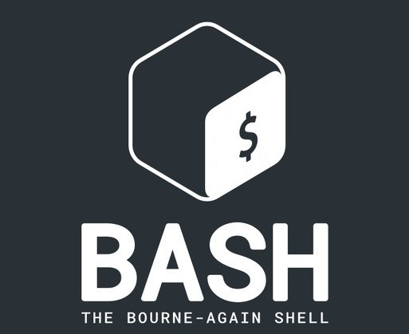

<h2>A passionate Cybersecurity student from Morocco</h2>

- 🔭 I’m currently working on my engineering degree  

- 🌱 I’m currently looking for an internship  

- 📫 How to reach me **benchehlaachraf@gmail.com** **achraf.benchehla@ump.ac.ma**

## My Skill Set  

  
  
  
  
      
   
  

</td><td valign="top" width="33%">

  
  
  
  
  
   </a>

</td><td valign="top" width="33%">

  
  
  

</td></tr>

## Connect with me  

  

  

## Other
  
<!--  

   
  
&nbsp;

-->

<!--
FOR HELP 
**ACHRAF-BENCHEHLA** is a ✨ _special_ ✨ repository because its `README.md` (this file) appears on your GitHub profile.

Here are some ideas to get you started:

- 🔭 I’m currently working on ...
- 🌱 I’m currently learning ...
- 👯 I’m looking to collaborate on ...
- 🤔 I’m looking for help with ...
- 💬 Ask me about ...
- 📫 How to reach me: ...
- 😄 Pronouns: ...
- ⚡ Fun fact: ...
-->
